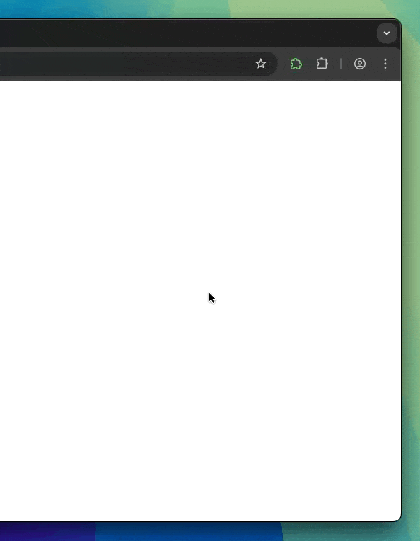

# create-sidepanel-extension

Scaffold a browser sidepanel extension with Tailwind CSS 4 + shadcn/ui — pick the framework you like.

## Usage

```bash
npm create sidepanel-extension@latest my-extension
# or
pnpm create sidepanel-extension my-extension
```

The CLI asks which framework to use, or you can pass it directly:

```bash
pnpm create sidepanel-extension my-extension --framework plasmo
```

Then:

```bash
cd my-extension
pnpm install
pnpm dev
```

Load the generated extension in `chrome://extensions` (Developer mode → Load unpacked).

## Frameworks

| Framework | Template | Notes |
| --- | --- | --- |
| [WXT](https://wxt.dev) | [`templates/wxt`](templates/wxt) | Vite-based, multi-browser (Chrome/Firefox/Edge/Safari) |
| [Plasmo](https://www.plasmo.com) | [`templates/plasmo`](templates/plasmo) | React-first, batteries included |

Every template ships the same product: a sidepanel that opens when you click the toolbar icon, shadcn/ui components on Tailwind CSS 4, system/light/dark theme support, persisted settings, and full TypeScript.

## Demo



## Repository layout

```
├── bin/cli.mjs       # The CLI (published to npm as create-sidepanel-extension)
└── templates/
    ├── wxt/          # WXT + shadcn/ui template
    └── plasmo/       # Plasmo + shadcn/ui template
```

Templates are downloaded from GitHub at scaffold time (via [giget](https://github.com/unjs/giget)), so the npm package stays tiny and freshly scaffolded projects always match `main`.

## Developing this repo

```bash
pnpm install                  # installs the CLI and the WXT template (pnpm workspace)
pnpm -r build                 # builds the WXT template

cd templates/plasmo
pnpm install && pnpm build    # the Plasmo template is standalone (own pnpm workspace)
```

Dependency updates (including the whole UI stack) are handled by Dependabot — see `.github/dependabot.yml`.

## License

Apache-2.0 — see [LICENSE](LICENSE).
